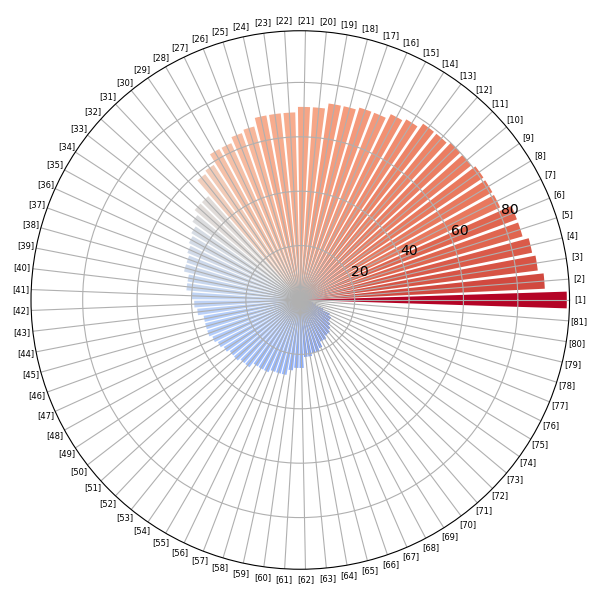
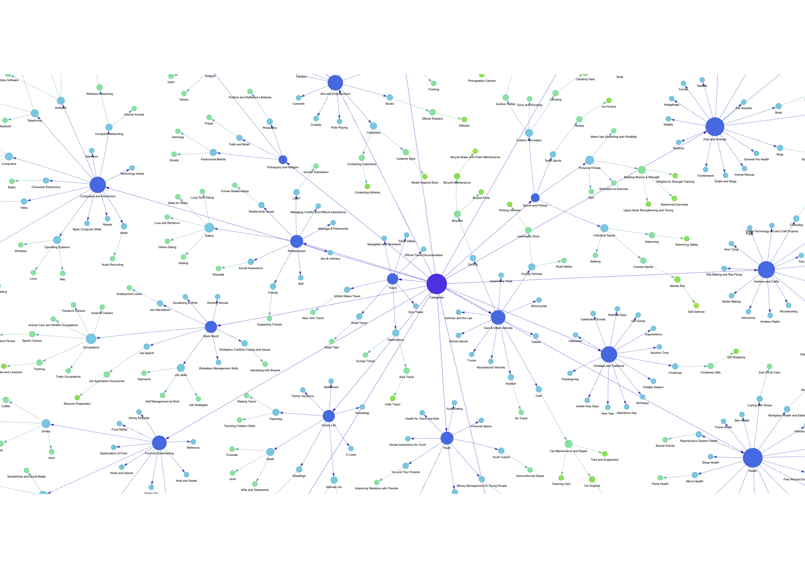

# WorldTaskEval
## 1. Introduction
Large language models (LLMs), such as ChatGPT, are increasingly used to generate responses based on human instructions. 

> Can LLMs be effective in helping humans complete concrete tasks in real-world scenarios?

While several studies have evaluated LLMs' performance on specific tasks, the scope of these evaluations remains limited. In contrast, a vast number of practical tasks exist in the real world. For example, WikiHow contains hundreds of guidelines that teach people how to perform tasks, which cover  a wide variety of human-written tasks ranging from "how to bake a cake" to "how to build a jet." 

The objective of this project is to assess LLMs' ability to assist with real-world task completion.

### Key concepts
Categories
Sub-categories
Topic
Question

## 2. AutoEvalution Workflow

## 3. Dataset

### Statistics
|   | Total Number  | Avg Token  |
|:-|-:|-:|
| Document | 3,680  | 1516.66 |
| Method | 14,738  | 304.34 |
| Step | 49,344  | 88.60 |
| Q & A | 6,093  | 52.32 |
| Tips | 6,495  | 29.59 |
| Warnings | 2,899  | 30.35 |
| Reference | 3,680 | 7.38 |
|||

- Average methods per document: 4.00
- Average steps per method: 5.18
- Average QAs per document: 1.66

### Task distribution over massive topics

### Knowledge Graph Screenshot & Statistics
- Total nodes (categories): 727
- Root nodes: 1
- Leaf nodes: 415

[View Interactive Knowledge Graph via a Browser](figure/interactive_knowledge_graph.html)

